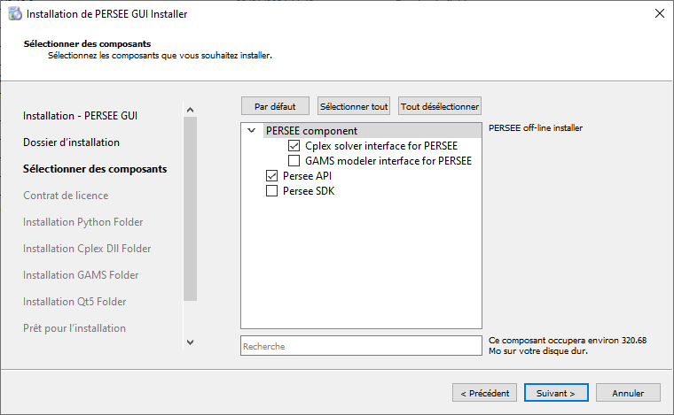
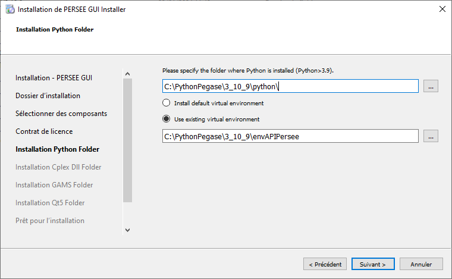
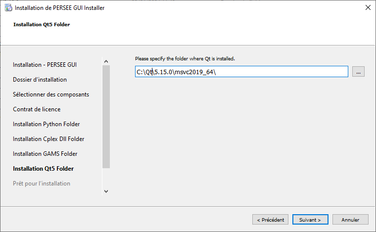

.. _installp:

###################
Installing |cairn|
###################

Dependencies
============

**Required dependencies**

.. list-table:: Required dependencies
   :widths: 100 100 100
   :class: longtable

   * - Package
     - Version
     - Use
   * - |python|
     - 3.10.9
     - Post-treatment, sensitivity studies
   * - Microsoft Visual C++ 2015 Redistributable
     - 2015
     - The Visual C++ Redistributable Packages install the runtime components needed to run C++ applications built using Visual Studio 2015 (C Runtime (CRT), Standard C++, MFC, C++ AMP and OpenMP).

**Optional dependencies**

.. list-table:: Optional dependencies
   :widths: 100 100 100
   :class: longtable

   * - Package
     - Version
     - Use
   * - |cplex|
     - 20.1
     - Use commercial solver |cplex|
   * - |gams|
     - 
     - Use commercial modeller |gams|

Standalone installation
=======================

- **Windows**

	- In the documentation, **CAIRN_APP** refers to the root directory.
	- Use the installer Cairn_3.n.m, n being the major release number and m the minor one (update).
	- Double click on the installer and follow the instructions (see :numref:`cairnInstaller`-:ref:`cairnInstaller`).
	- If you are using |cplex|, do not forget to check the |cplex| component, you will be asked to confirm default location later on.
	  Specify the path to |cplex| component and/or |gams| component if relevant and at the end, click on Install.
	- |python| 3.10.9 and a dedicated virtual environment are needed as a pre-requisite.
	  The virtual environment can be generated automatically by checking the box "Install virtual environment ?" 
	  (see :numref:`cairnInstaller|python|`-:ref:`cairnInstaller|python|`)

.. caution:: 
	
   You must accept the licenses.

.. figure:: images/CairnInstaller1.PNG
   :width: 500 
   :name: cairnInstaller
   :align: center

   Choose the components you want to install

.. figure:: images/cairnInstaller2.PNG
   :width: 500 
   :name: cairnInstaller|python|
   :align: center

   Specify the path for |python| environment 

.. ifconfig:: cea_content
  
  .. include:: ../privateDoc/about_cairn/installation_cea_windows.rst

.. ifconfig:: cea_content
  
  - **CEA linux server**

  1 linux server is accessible at LSET:

  #. AAR

  To be documented...

|python| package installation
=============================

Dependencies
------------

**Required dependencies**

.. list-table:: Required dependencies
   :widths: 200, 200, 200
   :class: longtable

   * - Package
     - Version
     - Use
   * - Qt
     - 5.15
     - 

The cairn |python| |api| can be installed together with cairn through the installer.

At the beginning of the installation process, select the component cairn API.

   Select the component cairn API.

You can choose to install the cairn |python| |api| in a default virtual environment (with this option, the environment is created and required python packages are installed) or in your existing virtual environment.

   Choose the python environment in which you want to install the cairn |python| |api|.

Qt is now mandatory so fill in your Qt path.

   Fill in your Qt path.

Another possibility is to install it directly with the 7z file:

To install cairn |python| |api| package in your current |python| environment, do the following :

  #. Unzip folder cairn-{version}-Source.7z

  #. In file cmake/default_options.cmake, change the installation path of Qt and/or |python| and |python| environment if necessary

  #. Through a command window, activate your |python| environment

  .. code-block:: batch

    activate.bat

  #. Change the directory to the unzipped folder

  #. At the root of the unzipped folder, launch the command :

     .. code-block:: batch

	   pip install . -v

The installation process takes time as |cairn| is built.

.. ifconfig:: cea_content

  .. include:: ../privateDoc/about_cairn/installation_module_cairn.rst
