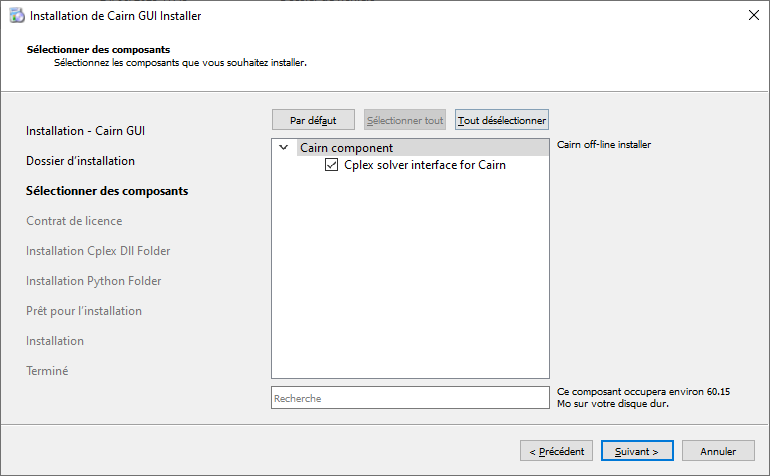

.. _installp:

##################
Installing |cairn|
##################

Dependencies
============

**Required dependencies**

.. list-table:: Required dependencies
   :widths: 100 100 100
   :class: longtable

   * - Package
     - Version
     - Use
   * - |python|
     - 3.10.9
     - Post-treatment, sensitivity studies
   * - Microsoft Visual C++ 2015 Redistributable
     - 2015
     - The Visual C++ Redistributable Packages install the runtime components needed to run C++ applications built using Visual Studio 2015 (C Runtime (CRT), Standard C++, MFC, C++ AMP and OpenMP).

**Optional dependencies**

.. list-table:: Optional dependencies
   :widths: 100 100 100
   :class: longtable

   * - Package
     - Version
     - Use
   * - |cplex|
     - 20.1
     - Use commercial solver |cplex|

Standalone installation
=======================

- **Windows**

	- In the documentation, **CAIRN_APP** refers to the root directory.
	- Use the installer Cairn_r.n.m, r being the major release number and n the minor one (update) and m the bugfix version.
	- Double click on the installer and follow the instructions.
	- If you are using |cplex|, do not forget to check the |cplex| component, you will be asked to confirm default location later on.
	  Specify the path to |cplex| component if relevant and at the end, click on Install.
	- |python| 3.10.9 and a dedicated virtual environment are needed as a pre-requisite.
	  The virtual environment can be generated automatically by checking the box "Install virtual environment?"

.. caution:: 
	
   You must accept the licenses.

   Choose the components you want to install

.. figure:: images/cairnInstaller2.PNG
   :width: 500 
   :name: cairnInstaller|python|
   :align: center

   Specify the path for |python| environment 

.. ifconfig:: cea_content
  
  .. include:: ../privateDoc/about_cairn/installation_cea_windows.rst

  .. include:: ../privateDoc/about_cairn/installation_cea_linux.rst

|python| package installation
=============================

A wheel is available on GitHub.

Only windows plateform is supported so far.

Dependencies
------------

**Required dependencies**

.. list-table:: Required dependencies
   :widths: 200, 200
   :class: longtable

   * - Package
     - Version
   * - Qt
     - 5.15
   * - python
     - 3.10
   * - pybind11
     - 2.11.1
   * - pandas
     - >= 1.5.2

.. ifconfig:: cea_content

  .. include:: ../privateDoc/about_cairn/installation_api_installer.rst
  .. include:: ../privateDoc/about_cairn/installation_module_cairn.rst
