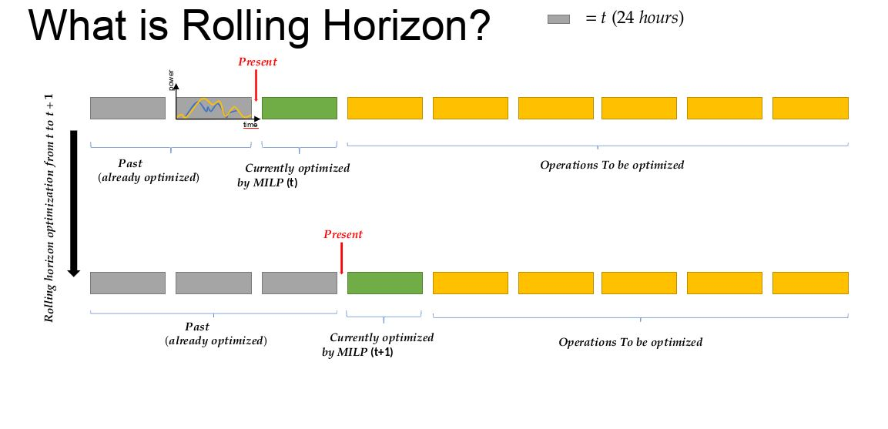
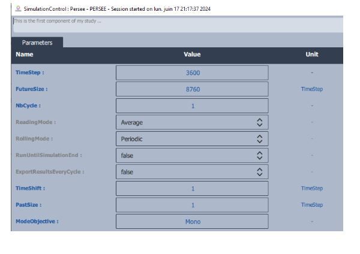

.. _rolling_horizon:

#####################
Rolling Horizon
#####################

In the following section the user can find practical informations concerning the rolling horizon functionality on the |cairn| platform.

What is rolling horizon?
================================

Rolling horizon is a technique used in optimization problems, 
in dynamic or time-dependent settings (such as energy systems), for better scheduling, and, or control systems.
A rolling horizon approach solves a sequence of optimization problems over a moving time window as it is shown in :numref:`Rollinghorizon`. At each step:

- The model solves an optimization problem over a finite time horizon (e.g., today to 7 days ahead).

- It implements the decision for the first period only (e.g., just today’s decision).

- The time window is shifted forward (e.g., tomorrow to 7 days after tomorrow).

- The problem is solved again with updated information (e.g., better forecasts or observed values).

- This repeats until the end of the full planning period is reached.

   Visual of how rolling horizon works 

.. note::
      At this stage, on |cairn|, usually the rolling horizon technique is applied once a first sizing optimization phase has been done.
      Once the size of components are fixed, rolling horizon can be used to improve the control over time dependent components (e.g. Storage systems)

How to set the rolling horizon mode?
================================

On |cairn|, the rolling horizon can be set by using the PERSEE component and set the following parameters: 
- Futuresize: size of the moving window to be optimized
- NbCycle: N° of windows to be optimized
- Timeshift: Shifting value of the window for the next cycle
The figure :numref:`SetParameters` below shows an example set for these parameters

   Parameters to be set on component for rolling horizon 

Once the parameters are set, the user must set the Rolling Horizon mode on the components concerned by going on the option list
and by setting the control on "Rolling Horizon".
