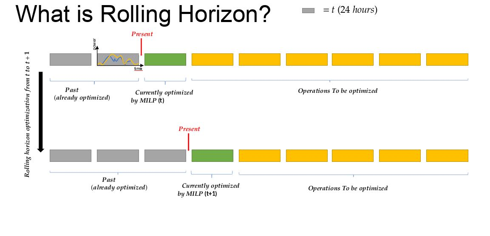
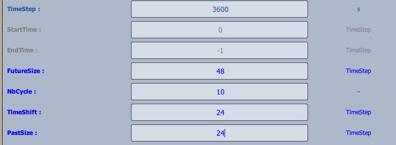

.. _time_management:

#####################################################################
Overview of time management with Cairn
#####################################################################

Cairn offers the possibility to be ran with several modes for time management, for several purposes:

- One-Shot optimization allows to optimize sizes and behaviour of components for one period at the same time. This is usefull to get optimal sizing of components and associated commands. But this can be over-optimize because the real system cannot predict the timeseries for long periods. 
- :ref:`rolling_horizon` allows to run optimization for shorter timeframe, to shift the frame and to re-launch the optimization from a new starting point. In this case, the sizing is fixed, to avoid to resize the component at each cycle. 
- Model Predictive Control (MPC) works the same as for Rolling Horizon but the initial state of each cycle is defined by an external program or by the real system. See :ref:`MPC_howto` for more information. 

.. figure:: ../images/diff_methods_rh_oneshot_mpc.JPG
   :alt: Overview of main methods of time management.
   :name: OverviewTime
   :align: center
   :scale: 50

   Overview of main methods of time management.

.. _rolling_horizon:

###############
Rolling Horizon
###############

In the following section the user can find practical informations concerning the rolling horizon functionality on the |cairn| platform.

What is rolling horizon?
========================

Rolling horizon is a technique used in optimization problems, 
in dynamic or time-dependent settings (such as energy systems), for better scheduling, and, or control systems.
A rolling horizon approach solves a sequence of optimization problems over a moving time window as it is shown in :numref:`Rollinghorizon`. At each step:

- The model solves an optimization problem over a finite time horizon (e.g., today to 7 days ahead).

- It implements the decision for the first period only (e.g., just today’s decision).

- The time window is shifted forward (e.g., tomorrow to 7 days after tomorrow).

- The problem is solved again with updated information (e.g., better forecasts or observed values).

- This repeats until the end of the full planning period is reached.

   Visual of how rolling horizon works 

.. note::
      At this stage, on |cairn|, usually the rolling horizon technique is applied once a first sizing optimization phase has been done.
      Once the size of components are fixed, rolling horizon can be used to improve the control over time dependent components (e.g. Storage systems)

Parameters to manage time
========================================

On |cairn|, the time is managed by the **SimulationControl** component with the following parameters: 

- TimeStep: size of a timestep of the optimization in second (can be a float number)
- FutureSize: size of the window to be optimized in number of TimeStep
- NbCycle: number of windows to be optimized (one if One-Shot optimization)
- Timeshift: Shifting value of the window for the next cycle in number of timesteps.
- PastSize: number of past time step necessaries to run keep in memory to run the next optimization. This parameter has to be greater or equal to Timeshift.
- StartTime: start the optimization at the timestep of the number indicated. 

The figure :numref:`SetParameters` below shows an example set for these parameters. In this example, the time step is one hour, the simulation starts at the first time step of the timeseries given, the optimization is made over two days and updated each day. The cycles are run over ten days. 

   Parameters to be set on component for rolling horizon 

.. figure:: ../images/parametres_simucontrol.JPG
   :alt: SetParameters_illustration
   :name: SetParameters_illustration
   :align: center

   Illustration of parameters of simulation control.

Once the parameters are set, the user must set the Rolling Horizon mode on the components that requires an initial state or a knowledge of the past by going on the option list and by setting the control on "Rolling Horizon".
