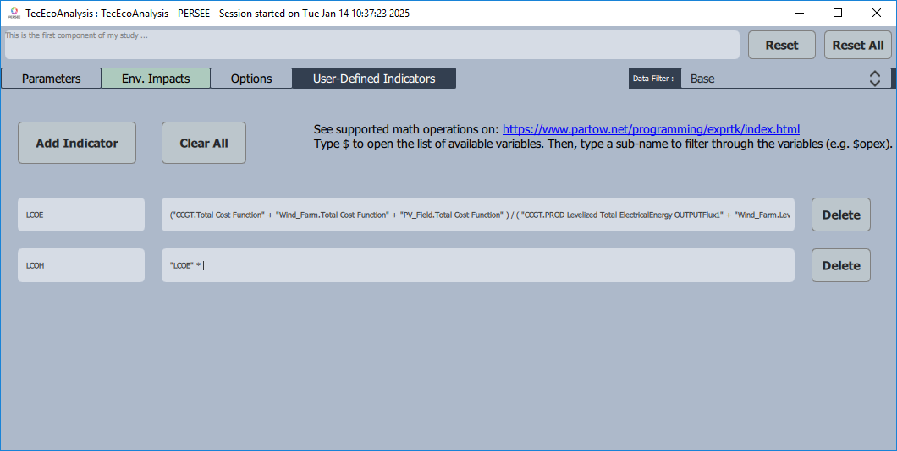

.. _cairn_UDI:

How to build a |udi|?
===================================================

In addition to the predefined indicators, the user can build his own indicator, called |udi|.

The predefined indicators and |udi| themself can be combined to build new |udi| owing to ExprTk package.
Thus, numerous forms of functional, logical and vector processing semantics are available.

The list of supported mathematical operations can be found in the link below:

`ExprTk <https://www.partow.net/programming/exprtk/index.html>`_

In practice, building a |udi| takes place in "TecEcoAnalysis" component, in the "User-Defined Indicator" tab.

   Example of |udi|

.. note:: 
	
   A |udi| is only a result that is calculated in the post-processing. It is not a variable that can be optimized.