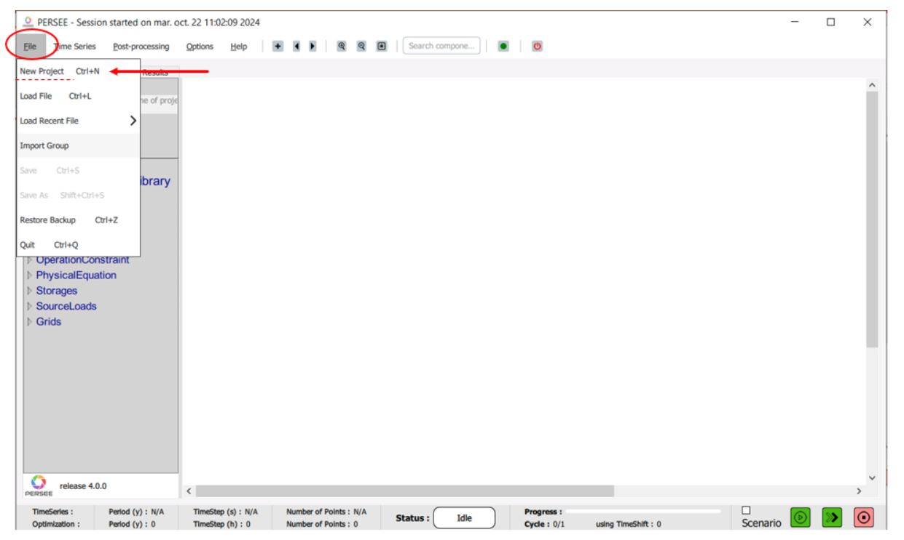
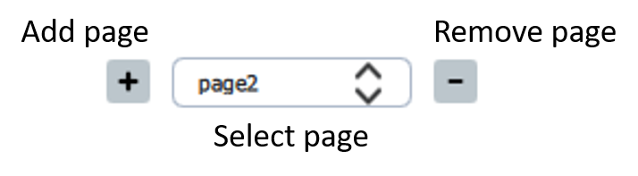
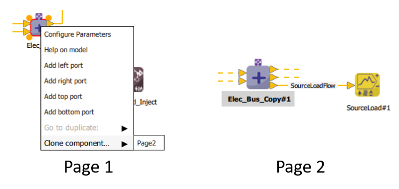
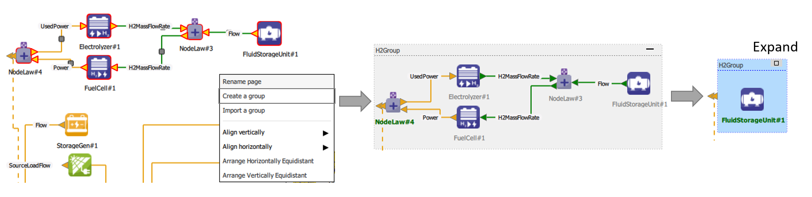
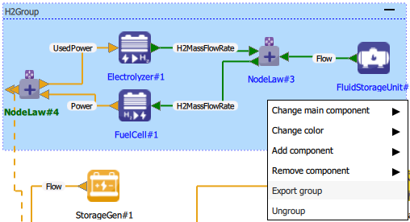
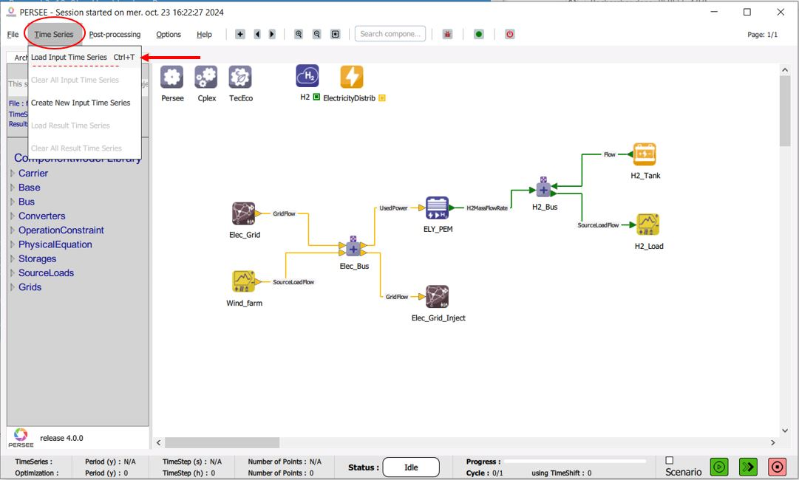
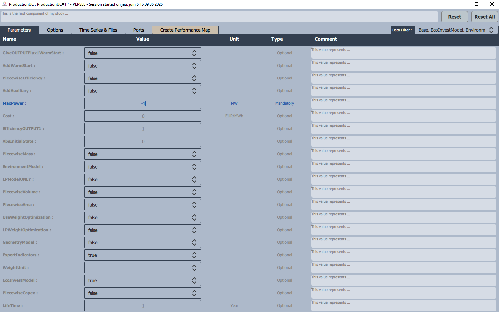
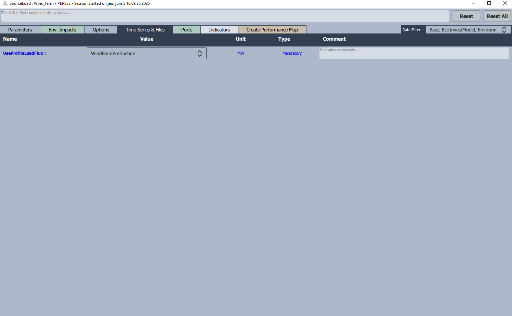
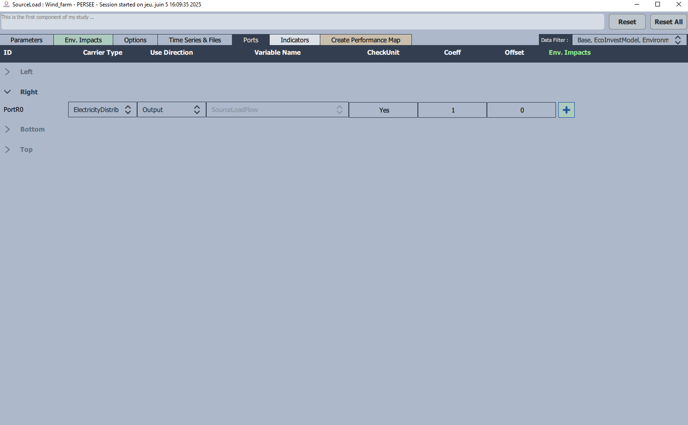
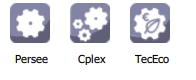

.. _build_a_problem:

#####################
Build a problem
#####################

In the following section the user can find practical informations concerning the basics for building up a problem in the |cairn| platform.

Getting started: Launch |cairn|
================================

To start |cairn|, run the provided **RunGui.bat** file. This will initialize the software and the graphical user interface (|gui|) will open. 
In order to create a new problem once the |gui| is open :

- Navigate to the **File** menu at the top-left part of the interface.
- Select **New Project** from the drop-down options as showed in :numref:`FigFirstProject`.
- A new window will appear. Here you can insert the name of your project and specify the path where you want to save it. 
- Now, click **Ok** to create your working files.

   Creating your first project

.. note::
      At this stage, the |cairn| team highly recommends saving your study in a folder with the same name as your project. 
      Since this phase (and future ones) will generate multiple files, it is best practice to keep everything organized in one folder.

Drag and drop components
========================

As the user can see, the **Study Data** frame now displays **your project’s .json** file, named after your project. 
This file has been successfully uploaded into the system.

In the |gui| interface, three base components will appear, providing the core structure for building your project. 
Additionally, the **Component Model Library** frame, located on the left side of the screen, is now accessible.

As shown in :numref:`TypeofComponents`, |cairn| organizes the components into four categories. 
These categories will guide the user in selecting the necessary elements to construct their project.

.. container:: cadre 

    .. figure:: images/Init_2.JPG
	   :alt: 4 Type of Components
	   :width: 600
	   :align: center
	   :name: TypeofComponents

	   4 Type of Components listed in |cairn|

- The first category defines the base components, which are essential to define the backbone of the optimization problem
  (Objective function, Environmental impacts, Optimization algorithm settings and time horizon configuration).
- The second category defines the energy carriers of your problem, and the physical properties associated.
	.. seealso:: 

		a. :ref:`SetEnergyVector`.

- The third category defines the physycal models of your problem. The different modules provided replicate the physical 
  behavior of existant technologies. More information can find in the Submodule Chapter. 
- The last category defines the constraint components, which allows to set the constraints to your optimization problem.

As it can be seen, |cairn| adopts a **modular approach**, which allows users to model complex energy systems with a high degree of flexibility. 

These component blocks can be easily **dragged and dropped** into the graphical user interface (|gui|). 

By connecting the components, the user effectively writes the equations governing energy flows, operational limits, and other constraints within the system. 

.. hint::
   A highly efficient way of working with |cairn| is to first **conceptualize** the energy system you are studying. 
   Visualize how the different components of the system should be interconnected to achieve the desired energy flow and performance.
   Once the system is clearly imagined, all you need to do is recreate it in |cairn| using the **drag-and-drop** functionality.

Using :numref:`SampleofFirstArchi` as a reference, you can begin building the energy system in |cairn|. 
Start by identifying the components in the system and **dragging** the corresponding module from the 
**Component Model Library** to the working space on the |gui|.

|

.. hint::    
   Better start from the carriers that are going to be used in the system, 
   in order to easily connect later on the components between eachother. 

.. container:: cadre 

	.. figure:: images/Init_3.JPG
		   :alt: Sample of the first architecture to be represented
		   :width: 600
		   :name: SampleofFirstArchi
		   :align: center

		   Sample of the first architecture to be represented

Each module represents a part of the energy system. For example :

   - If you need a diesel generation unit, drag the module that represents a cogeneration generator.
   - For energy storage, select the appropriate carrier storage component.

So far, we should have something similar to :numref:`DragandDrop`.

.. container:: cadre 

	.. figure:: images/Init_4.JPG
	   :alt: Drag and drop of components of interest
	   :name: DragandDrop
	   :width: 600
	   :align: center
	   
	   Drag and drop of components of interest

Now we need to make the connections between the components.

.. include:: link_components.rst

How to manage big architectures?
================================

The |gui| allows to create several pages to manage big architectures.
      
Each page can hold 150 components.

   Pages management, adding a page opens a popup to name the page.

The definition of an energy carrier is shared between all the pages.

Links between the pages can be done through the buses: a bus can be "cloned" by righting clicking on it.

   Cloning a bus to another page in order to be able to add a new port useable in the other page.

Removing a page deletes all the components except the energy vectors used in other pages.

.. note::

   A page can be renamed by right-clicking on an empty space on the page and clicking the Rename page function.

How to use groups?
==================

Group of components can be created.

To do so, select all the components that should be in the group. Right click in the page and select "Create a group".

   The steps of a group creation.

Once the group is created, its name can be changed at the top left of it. At the top right, it can be reduced or expanded.

   Different options are available by right clicking inside the group.

* The main component that is displayed when the group is reduced can be changed.

* The background color can be chosen among a list.

* Adding or removing a component inside the group can be done.

* Exporting the group can be done. Thus, it saved in .json format and it can be importing in another project in File menu/Import group.

* Ungroup the group can also be done here.

.. _load_input_timeseries:
Upload the Input time series
===========================

Now that the architecture is defined on the |gui|, the user can proceed to upload the Input Time Series by using the 
dedicated drop down menu as showed in :numref:`LoadTimeSeries`.

|

   Loading a time series for input data

After clicking on it, the user will upload the .csv file associated with the proper format.
As soon as the Time Series is uploaded, the user can verify if the data has been correcly imported by using the plotter of |cairn|.

To do so, click on **Results** in the left frame **Study Data**, and then follow the same instructions as for plotting the Results. 

|

.. seealso:: 

	- :ref:`cairn_timeseriesfile`.

Set Model Parameters
====================
Once a model has been drag and dropped on the |gui|, and its energy vectors well specified, by double-clicking on it, a list will appear 
on the board naming the different parameters of the model as showed in the example of :numref:`Parameterscomponent`.

   Parameters window opening when double-clicking right on a component

The parameters that are highlighted in **blue** are **Optimization** parameters. The convention used by |cairn| to define these variables is the following: 

.. note::

   An Optimization variable must be defined with the **negative sign**. In this why, the user is defining the max value that this variable could have and 
   the min value as 0. 

Each component has its own set of parameters depending how it has been modeled. To have more details about the static and optimization parameters, please refer to the section - :ref:`attention`.
As it can been seen in the upper part of the window, other sections are available. 
The **Time Series & Files** section is used to upload into the model the considered time series if needed. Once the time series file have been upload into |cairn| (refer to the previous section),
the user can find the desired time series in the dropdown menu as shown in :numref:`Timeseries_Uploading`.

   Uploading the correct timeseries into a component
.. note::

   When finding the timeseries for your component, bear in mind that is very important to be coherent with the unit measure of the timeseries 
   defined in the CSV input file (eg. if the energy vector of your component is electricity, then the component model expect a timeseries input expressed in W). 

The **Ports** section is used to have a clear explanation on how the ports of your model are used, which variables of the model are referred to and if there is a multiplier
coefficient that is applied on that variable. In addition, when the EnvironmentalModel parameter is set on True, an additional section to assign environmental parameters is
highlighted by a **Green Plus Sign** on the right.

   Ports section

.. note::

   The multiplier coefficient can be used for various operations that are not necesserely implemented in the model itself.
   For more information, please refere to the section "Advanced usage of a Converter" 

Set Base Components Parameters
==============================

The **Base Components** are present from the beginning of the creation of a |cairn| project, in the upper left corner. 

* **TecEco** component allows to take into account possible environmental impacts of your case study as well as its lifetime and economic impacts over years. 
   For more information, please refer to the section :ref:`cairn_environmental`
* **Persee** component defines the timestep of the problem and the optimization time horizon. 
   For more information, please refer to the section "Rolling Horizon"
* **Cplex** component is intended to use to have access to the optimization solver and change the parameterization of it. 
   For more information, please refer to the section "Optimization???"

   Base_components

Launch the optimization

Once the time series are correctly upload, the parameters of components are set and objective fixed, the user can launch an optimization
process by clicking the green button **Run Simulation** on the right low corner of the GUI window, as in figure :numref:`Launch`.

.. figure:: images/Launch.JPG
   :alt: Launch
   :name: Launch
   :width: 600
   :align: center

   Launch button

If the user wants to launch only one scenario and name it, it can thick the box on the left of the launch button. A window asking for the 
name of the particular case under analysis will appear and a folder contaning the results of it will be automatically created by |cairn|.
The red button on the right of the launch button is a "Stop Simulation" button, which will immediately end the optimization. 
However, the results of the optimization will be preserved and saved up until the moment the red button has been pushed. 
=======================

