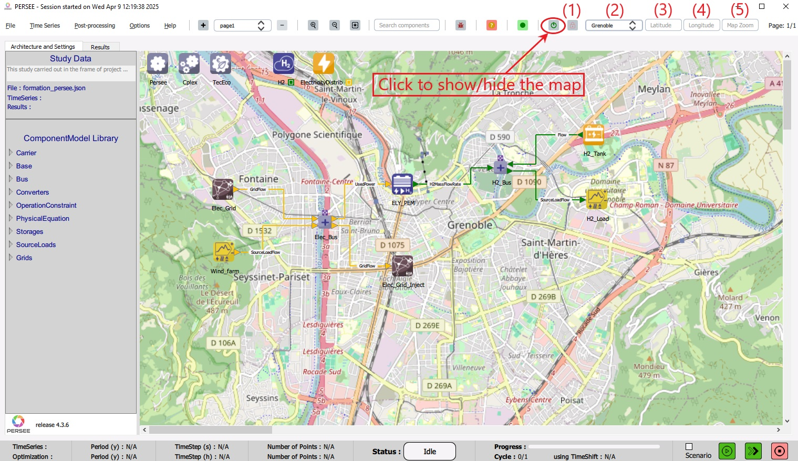

.. _display_map:

Display the map
================

|cairn| has a feature to display the study architecture on a map. 
The map can be shown/hidden by clicking the dedicated button on the Toolbar as shown in :numref:`DisplayMap`.

|

   Display the map

|

When the map is activated (the color of the button is green), a map-related section on the Toolbar appears. This provides a set of tools to control the map : 

(1) Lock button: when it is unlocked (the color is green), the map can be dragged under the study by clicking anywhere on the map then swiping.

(2) Locations List: a drop-down list of pre-defined locations from where the user can choose a location.

(3) Latitude: a text field where the user can input a certain latitude to go to it.

(4) Longitude: a text field where the user can input a certain longitude to go to it.

(5) Map Zoom: a text field where the user can input a certain map zoom. 

.. note::

	The Map Zoom is an attribute of the map. Modifying the zoom affects the map area to be displayed. It is not a feature to zoom inside the displayed map area. 
	The default zoom is 13.5.

.. note:: 
	
   Writting in the text fields Latitude, Longitude, and Map Zoom takes effect only after pressing the Enter key. 
   The user can write in one field or more then press the Enter key once inside any field.
