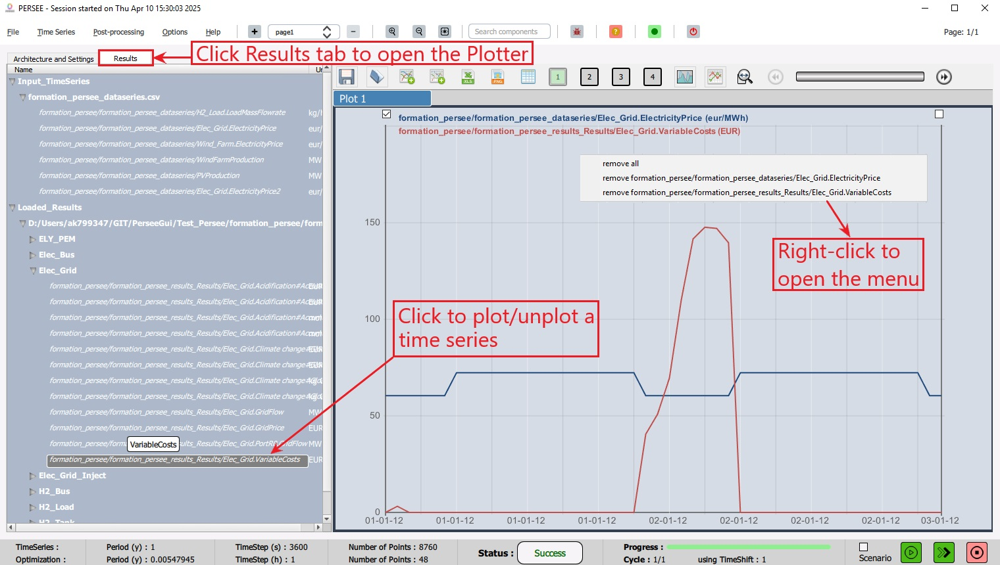
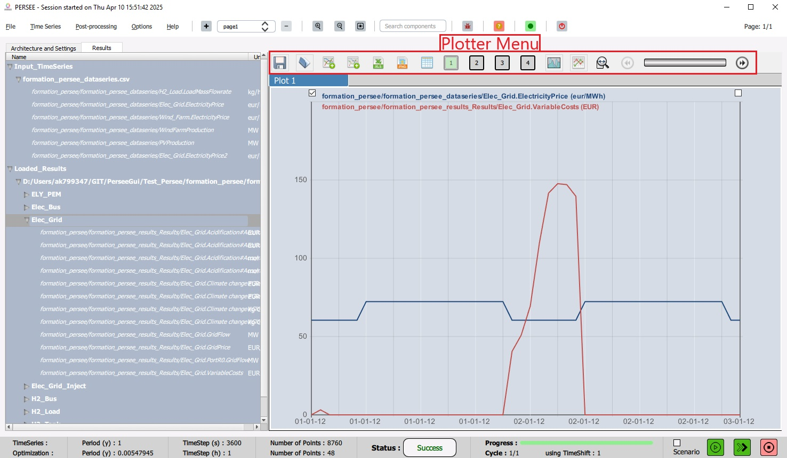
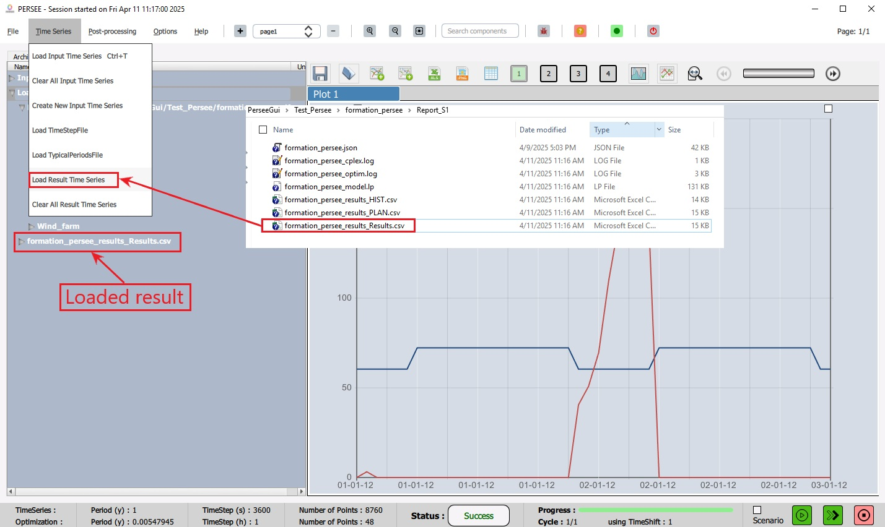

.. _display_results:

################## 
Display results
################## 

This section describes how to plot the results and list the features available in the plotter.

.. _plot_timeseries:
Plot TimeSeries
================

After performing a simulation with |cairn|, the user can plot the result time series as shown in :numref:`PlotTimeSeries`.
The user can switch to the plotter-view by clicking on the **Results** tab on top of the left-hand side area. 

.. note:: 
	
	The user can switch back to the plan-view by clicking on the **Architecture and Settings** tab. 

	
On the plotter-view, the user finds, under *Loaded_Results*, an item for the result time series corresponding to the last simulation performed (which is automatically loaded). 
The user also finds an item for every loaded input time series file under *Input_TimeSereis*. To know how to load an input time series, see :ref:`load_input_timeseries`.

.. note:: 
	
   When performing several simulations for different studies/scenarios in the same session, an item for each study/scenario appears under *Loaded_Results*. Similarly, if a simulation has several solutions, an item appears for every solution.
   
|

   Plot TimeSeries

|

The user can plot/unplot a time series by clicking its name in the list. The user can also remove a time series graph or all the graphs by performing a right-click and selecting an item from the menu. 

.. note:: 

	The user can load a result file from a previous simulation, see :ref:`load_result_timeseries`.
	
   
Plotter Menu
=============

The plotter has a dedicated menu to perform the following actions (from left to right-hand side as shown in :numref:`PlotterMenu` ): 

	* Save a plotter configuration (.xml file)

	* Open a plotter configuration

	* Add an f(t)-chart
	
	* Add an XY-chart to plot a time series with respect to another time series
	
	* Export the plotted time series to a .csv file
	
	* Save the current chart as a .png image
	
	* Show a table view 
	
	* The boxes 1 to 4 are used to add/remove the plotter areas. Each area allows to plot up to 8 time series. Area 1 is enabled by default. The color of the box is green when the area is enabled and gray when it is disbaled.
	
	* Switch to fill mode, that is, to fill the area under the graph
	
	* Switch to dot mode, that is, to display the dots on the graph
	
	* Change the display range (time-axis range), e.g., Day, Week, Month, Full. 
	
	* A slider to shift the view when the entire range is not displayed.

|

   Plotter Menu

|

.. _load_result_timeseries:
Load Result TimeSeries
=======================

The user can load the result file from a previous simulation by opening the "Time Series" menu from the Toolbar then clicking "Load Result Time Series" item as shown in :numref:`LoadResultTimeSeries`.  
This allows the comparison of results from different studies/scenarios by plotting them on the same graph.

|

   Load Result TimeSeries

|

Once a result file is uploaded, a corresponding item will appear on the **Results** tab under *Loaded_Results*. The related time series can then be plotted as described in :ref:`plot_timeseries`.
