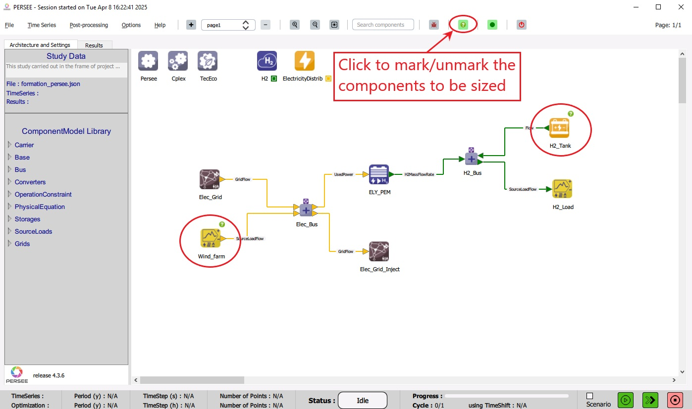

.. _display_sized_components:

Display the components to be sized
===================================

After setting up the architecture, the user can display marks on the components to be sized (optimized) by clicking the 
dedicated button on the Toolbar as shown in :numref:`DisplaySizedComponents`.

|

   Display marks on the components to be sized 

|

When the button is clicked, a question-mark icon is displayed on the top-right side of every componenet to be sized, 
for examples, a SourceLoad whose Weight is negative and a StorgeGen whose MaxEsto is negative. When the button is clicked again the marks are removed. 

The marks are displayed when the color of the button is green, and they are hidden when the color of the button is red.