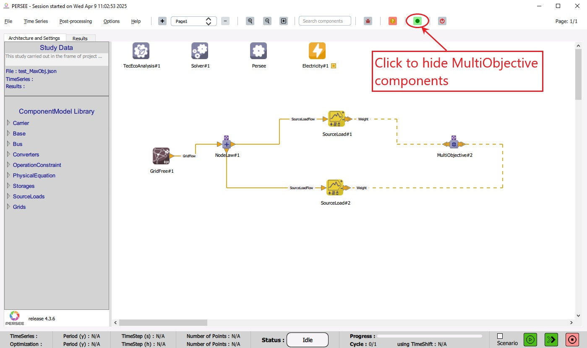
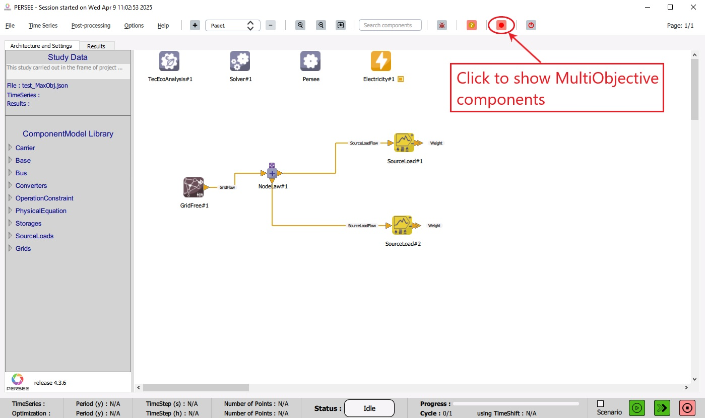

.. _hide_multiobjective_components:

Show/Hide MultiObjective components
===================================

The user can show/hide MultiObjective components (and their links) by clicking the dedicated button 
on the Toolbar as shown in :numref:`HideMultiObjectiveComponents` and :numref:`ShowMultiObjectiveComponents`.

|

   Hide MultiObjective components and their links

   Show MultiObjective components and their links
   
|

The MultiObjective components are shown when the color of the button is green, and they are hidden when the color of the button is red. 

.. note:: 
	
   Hiding the MultiObjective components doesn't modify the study and doesn't affect the result of the simulation. It is only a feature to display the architecture 
   without the MultiObjective connections.
