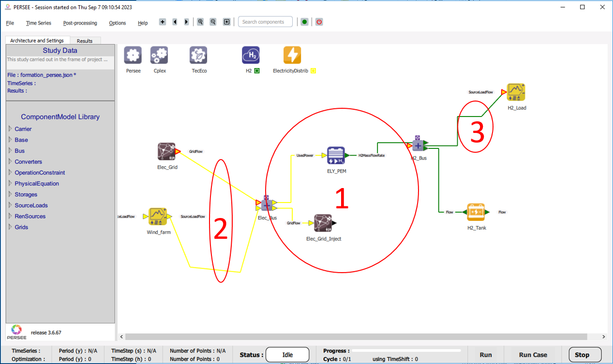

How to link components?
=======================

After placing the components, **connect** them together by defining the carrier that is used by each component. 
To do so, right click on the arrows and select **Set Carrier**.

These connections will form the **energy balance** and set the groundwork for defining the system’s **constraints**.

As you continue, ensure that the setup of the components mirrors the conceptual system you've imagined.

In order to connect the components between eachother and ensure the energy balance, 
a **Node law** or a ** NodeEquality** is necessary to perform flow balances ; technological components cannot be connected directly but through buses.

.. note::

   Three types of buses exist:
    
   * Node law

   * NodeEquality

   * MutliObjective

.. note:: 
	
   The energy vector propagates when connecting one port to another: the energy vector of the arrival port automatically aligns with that of the departure port.

There are 3 different types of link. The way to draw them is described below (:numref:`FigHowToLinks`):

   3 different link types
   
|

.. csv-table:: 3 different link types
	:file: links.csv
	:header-rows: 1
	:delim: ;
	:class: longtable
	:align: center
	:name: links
	:widths: 1 1 1
