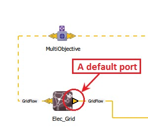
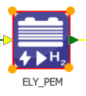

#####################
Shortcuts and options
#####################

This sections describes some functionnalities of the |cairn| GUI.

How to use shortcuts in |cairn|?
=================================

The following table gives the shortcuts that can be used in |cairn|.

.. csv-table:: |cairn| shortcuts
	:file: shortcuts.csv
	:header-rows: 1
	:delim: ;
	:widths: 10 100 100
	:class: longtable
	:name: shortcuts
	:align: center

Default ports
=============

Every component comes with a set of default ports. 
As shown in :numref:`DefaultPortBorder`, the border of a default port is in a bold black color, 
while the border of a non-default port is in a light gray color. 

A default port of a component cannot be removed, and must has a carrier (an EnergyVector) even if it is not connected. 

   Default port border

.. note:: 
	
   Bus components are an exception. Indeed, technically, a Bus component doesn't have essential ports. 
   A Bus port is a "mirror" of the connected component port.

   
How to change the size of a component?
======================================

Select the component.

Now it is surrounded by a colored frame and each corner of this frame can be used to increase or decrease the size of the component.

   Increase the size of a component

   
.. include:: display_sized_components.rst
.. include:: hide_multiobjective_components.rst
.. include:: display_map.rst